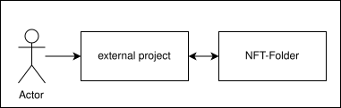

[[chapter-building-block-view]]
:docinfo: shared
:toc: left
:toclevels: 3
:sectnums:
:copyright: Open Logistics Foundation License 1.3

= Building Block View

The building block view is a static and hierarchical decomposition of the system into building blocks and their relationships.
It is a collection of black box and white box descriptions for all important components.
Building blocks may be modules, components, subsystems, classes, interfaces, packages, libraries, frameworks, layers, partitions, tiers, functions, macros, operations, data structures, etc.).

In blackbox view, only the interface of the component is visible, not its internals.
However, for interface specifications including all method signatures and their descriptions we refer to the link:openAPI.json[OpenAPI documents].
Only other kinds of interfaces are described here.
This is a simplification of arc42 (which requires short description of interfaces), to avoid redundancy and inconsistencies, and to reduce documentation efforts.

== Overview

The {projectName} allows for the tokenization of Real-World Assets (RWAs), converting them into Non-Fungible Tokens (NFTs) and storing them on a private Ethereum-based blockchain.
This system consists of three Smart Contracts - Container, Segment, and Token - deployed on a Quorum blockchain, along with a microservice designed to interact with these deployed Smart Contracts.

Each NFT can be linked to a Segment, which, in turn, is part of a Container.
A Container is owned by a single organization and acts as a central hub for managing the organization's Segments and Tokens.
To access the functionalities of the Smart Contracts, a Blockchain Connector is utilized.

The microservice is the Project-specific Blockchain Connector.
It is specifically tailored for projects integrating the {projectName}, facilitating interaction with the Smart Contracts through the Blockchain Connector library.

== Whitebox {projectName} - Level 1

In level 1, the components of the {projectName} and their relationships are shown.

image::drawio/chapter_5/components_whitebox.svg[{projectName} components]

There are the following components with its responsibilities:

[cols="3",options="header"]
|===
|Name
|Status
|Responsibility / Description

|Project-specific Blockchain Connector
|Custom Development
|Handles token management for the organization by using the Blockchain Connector library. Specifically designed for each project integrating the {projectName}.

|Blockchain Connector (library)
|Custom Development
|Provides functions that can be used to communicate with the blockchain or smart contract functions.

|{projectName} Smart Contracts
|Custom Development
|Implements the features for tokenization and storage of Real-World Assets. Comprises the Container, Segment, and Token Smart Contracts.

|Quorum Blockchain
|Blockchain Platform
|Serves as a decentralized ledger storing information on Tokens, Segments, and Containers.
|===

For each {projectName} component we give a brief overview as a blackbox view.
For more details see Level 2 (Whitebox views of the components).

=== Project-specific Blockchain Connector (Blackbox)

The project-specific Blockchain Connector is a web service serving as a bridge between the project and the Smart Contracts.
It is customized to meet the specific requirements of a given project.
For instance, if a project solely intends to manage tokens using the {projectName}, the project-specific Blockchain Connector will only implement such token management functions.
It then uses the functions of the blockchain connector library to forward the requests to the blockchain.

This tailored approach ensures that the project-specific Blockchain Connector precisely aligns with the needs of the project it serves.
By focusing solely on the functionalities relevant to the project's objectives, it optimizes efficiency and streamlines operations within the project's ecosystem.

=== Blockchain Connector (Blackbox)

The Blockchain Connector is a library that provides a range of functions:

**Segment Management**

* Create a Segment
* Read Segments
* Add a Token to a Segment
* Remove a Token from a Segment

**Token Management**

* Mint a Token
* Read a Token
* Return all Tokens of a Segment
* Update a Token
* Burn a Token

This library is built using NestJs, and communication occurs via a RESTful API, utilizing JSON for data transfer.
It is intended to be integrated into project-specific microservices to enable them to access the blockchain

For further insights and detailed information, please consult the corresponding whitebox documentation.

=== {projectName} Smart Contracts (Blackbox)

The Smart Contracts within the {projectName} encompass various functions essential for storing and reading data on the Blockchain:

**Container**

* Create a Segment
* Read Segments associated with the Container

**Segment**

* Add a Token to a Segment
* Remove a Token from a Segment

**Token**

* Mint a Token
* Read a Token
* Update a Token
* Burn a Token

**TokenAdditionalInformation**

* Add additional information to a Token
* Read additional information of a Token
* Remove additional information from a Token

**TokenAsset**

* Set the Hash and URI of the asset to a Token
* Read the Hash and URI of the asset of a Token

**TokenMetadata**

* Set the Hash and URI of the metadata to a Token
* Read the Hash and URI of the metadata of a Token

**TokenSegmentAllocation**

* Add a Token to a Segment
* Read the Segment of a Token
* Remove a Token from a Segment

**TokenHierarchy**

* Add a Token to a hierarchy of Tokens
* Read the parent or child Tokens of a Token
* Confirm a Token as child Token

=== Quorum Blockchain (Blackbox)

Quorum Blockchain is a permissioned, enterprise-focused blockchain platform, based on the Ethereum protocol.
It is designed to offer privacy, high throughput, and enhanced performance for businesses and financial institutions by implementing features such as private transactions and permissioned networks.

In the context of the {projectName}, the Blockchain serves as the exclusive storage platform for tokenized assets related to Containers, Segments, and Tokens.
It is responsible for storing and managing the Smart Contracts, ensuring the integrity and security of the data stored within.

== Building Blocks - Level 2

In level 2, the black boxes of level 1 become white boxes.
We look into each component in detail.

=== Blockchain Connector (Whitebox)

This section describes the Blockchain Connector architecture and its implementation.
The Blockchain Connector is a single npm library.
Since the Blockchain Connector is intended to be integrated as a library in another Node.js project, the controllers described below are not necessary. The services should be used directly. The controller classes are used for testing purposes and can be activated or deactivated as required via an environment variable.

|===
|Component Collection |Component |Description

|**Data Integrity Management**
|
|

|
|Data Integrity Controller

(can be activated or deactivated as required)
|Provides REST endpoints that allow strings or entire documents to be hashed and the hash value returned.

|
|Data Integrity Service
|This service provides the functions required for hashing the strings or documents.

|**Segment Management**
|
|

|
|Segment Controller

(can be activated or deactivated as required)
|Provides REST endpoints, that are used to communicate with the Blockchain Connector. The Segment Controller invokes the Segment Service to execute Smart Contract functions. More details on the REST API can be found in the openAPI specification.

|
|Segment Service
|The Segment Service offers functionalities that use the capabilities of Smart Contracts to manage Segments. It relies on the Blockchain Service to generate transaction objects and send them to the Blockchain.

|**Token Management**
|
|

|
|Token Controller

(can be activated or deactivated as required)
|Provides REST endpoints, that are used to communicate with the Blockchain Connector. The Token Controller invokes the Token Service to execute the Smart Contract functions. More details on the REST API can be found in the openAPI specification.

|
|Token Service
|The Token Service offers functionalities that use the capabilities of Smart Contracts to manage Tokens. It relies on the Blockchain Service to generate transaction objects and send them to the Blockchain.

|
|Event Service
|The Event Service uses the Blockchain Service to retrieve Events from the Blockchain related to a specific Token. Information regarding the Events of a Token is then used by the Token Service to assemble the Token DTO for the response.

|**Blockchain Service**
|
|The Blockchain Service implements fundamental functionalities for interacting with the Blockchain, such as transaction handling. This service is used by the aforementioned services to create transaction objects and send them to the Blockchain.

|**Ethers Service**
|
|Establishes a connection to the Blockchain, which is then used by the Blockchain Service.

|===

=== {projectName} Smart Contracts (Whitebox)

The Smart Contracts within the {projectName} encapsulate the core functionality of the system.
They manage Containers, Segments, and Tokens.

|===
|Smart Contract |Description

|Container
|For each organization utilizing the {projectName}, a distinct instance of the Container contract is deployed on the Blockchain. This contract is responsible for the creation of new Segments, which are automatically associated with the Container. Additionally, the Container contract retrieves all Segments belonging to it.

|Segment
|The Segment contract is deployed via the Container contract. Given that the Container contract is owned by a particular organization, the Segment contract created through it is inherently tied to that organization. This contract handles the addition and removal of Tokens from the Segment.

|Token
|The Token contract implements functionality based on the ERC-721 standard. Consequently, it provides functions for the entire lifecycle of NFTs and offers additional features through five extension contracts.

|TokenAdditionalInformation
|The TokenAdditionalInformation contract extends the Token contract by providing functions to define and retrieve additional information, represented as a string, to the Token.

|TokenAsset
|The TokenAsset contract extends the Token contract by providing functions to define and retrieve the hash and URI of a RWA. The respective RWA is stored externally, not on the blockchain. The URI denotes the location of this external storage, while the hash represents the fingerprint of this RWA and serves to verify the asset's integrity.

|TokenMetadata
|The TokenMetadata contract extends the Token contract by providing functions to define and retrieve the hash and URI of the metadata of a RWA. The respective metadata is stored externally, not on the blockchain. The URI denotes the location of this external storage, while the hash represents the fingerprint of this metadata and serves to verify the asset's integrity.

|TokenRemoteId
|The TokenRemoteId contract extends the Token contract by providing functions to define and retrieve the specific identifier of a RWA. This identifier serves to uniquely identify the RWA within the external system, such as a database.

|TokenSegmentAllocation
|The TokenSegmentAllocation contract extends the Token contract by providing functions of assign and remove a Token from a Segment. A Token can be assigned to multiple Segments as needed.

|TokenHierarchy
|The TokenHierarchy contract extends the token contract and provides functions to mark tokens as the root of a new token hierarchy or to append them as a leaf to an existing hierarchy.
|===
